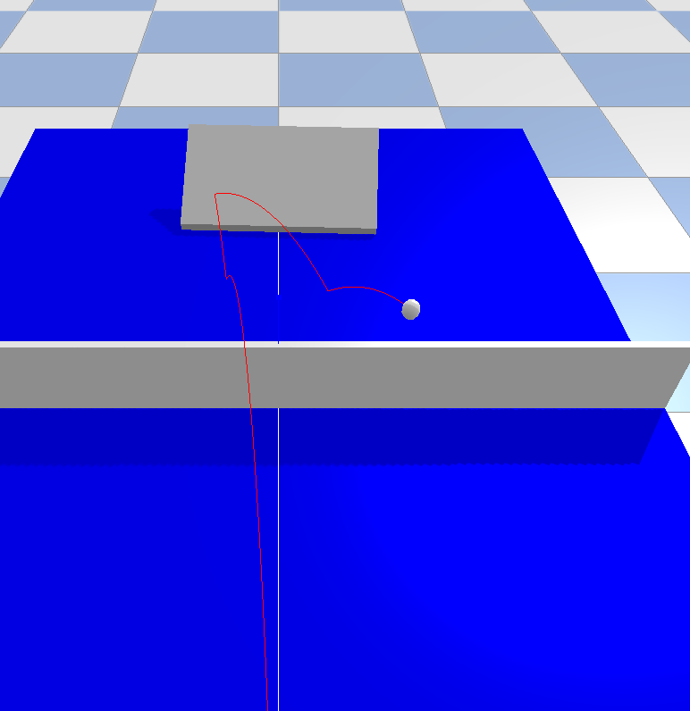

# Table Tennis Physics Simulation with PyBullet

A **realistic table tennis physics simulation** implemented using [PyBullet](https://pybullet.org/wordpress/), simulating ball spin (e.g. topspin, sidespin, backspin), Magnus force, collisions, and real-time paddle control. A 3D visualization script is provided to plot the ball’s trajectory.

## 🎓 Project Info

- **Course**: Computer Graphics 2025
- **Author**: Ku Ting-Jung (古庭榮)
- **Language**: Python 3
- **Physics Engine**: PyBullet
- **Features**:
  - Ball spin (topspin, backspin, sidespin, mixed)
  - Magnus force simulation
  - Paddle tilt control
  - Real-time trajectory drawing
  - Camera control
  - Keyboard interaction
  - Trajectory export as CSV

---

## 📦 Requirements

Install dependencies using:

```bash
pip install pybullet numpy
```

---

## ▶️ How to Run

```bash
python table_tennis_simulation.py
```

---

## 🎮 Controls

| Key       | Action                                |
|-----------|----------------------------------------|
| `r`       | Reset ball (no spin)                  |
| `1`       | Apply topspin                         |
| `2`       | Apply backspin                        |
| `3`       | Apply sidespin (reverse)                        |
| `4`       | Apply sidespin                      |
| `z`       | Tilt paddle forward (↑ angle)         |
| `x`       | Tilt paddle backward (↓ angle)        |
| `w/s`     | Zoom in / out camera                  |
| `a/d`     | Rotate camera left / right            |
| `q/e`     | Tilt camera up / down                 |

---

## 🧠 Simulation Features

### Table and Net

- Full-size table tennis table (`2.74m x 1.525m x 0.76m`)
- White center line and net with collision detection

### Ball

- Diameter: `40mm`
- Mass: `10g`
- Supports real-time spin via angular velocity
- Magnus effect force: `F = k * (ω × v)`
- Motion trajectory recorded and saved as `ball_trajectory.csv`

### Paddle

- Large flat surface with adjustable tilt (±60°)
- Positioned to intercept ball automatically
- Elastic and friction parameters customizable

---

## 📈 Output

After each simulation:

- The ball’s trajectory is saved to:
  ```
  ball_trajectory.csv
  ```

- Example format:
  ```csv
  x,y,z
  1.234,0.567,0.890
  ...
  ```

- Then plot the trajectory
  ```
  python plot_traj.py
  ```
---

## 🛠️ File Structure

```
table_tennis_simulation.py    # Main simulation code
README.md                     # This file
ball_trajectory.csv           # Output after simulation (auto-generated)
plot_traj.py                  # plot the trajectory
```

---

## 📷 Screenshots
- press 3 (reverse side spin)



---

## 📚 References

- [PyBullet Official Documentation](https://github.com/bulletphysics/bullet3)
- Physics principles: Magnus effect, angular momentum, collision dynamics
- Mencke, J. E., Salewski, M., Trinhammer, O. L., & Adler, A. T. (2020). Flight and bounce of spinning sports balls. American Journal of Physics, 88(11), 934–947. https://doi.org/10.1119/10.0001659
---

## 🧹 Cleanup

Press `Ctrl+C` to stop simulation safely. All connections to PyBullet will be closed using:

```python
scene.cleanup()
```

---

## 📩 Contact

Feel free to reach out for questions.

> Email: jnes0824@gamil.com

